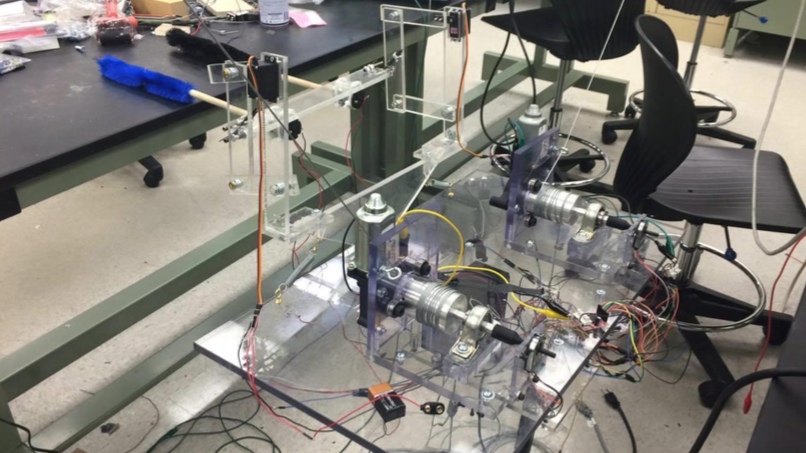

# WinRo
Window Cleaning Robot - 2016 Mechanical Engineering Senior Capstone Project at Ohio State University

## Final design

## Final build

This repo holds some arduino code for my senior capstone design project at Ohio State. We designed and built a cable suspended robot that used worm gear motor odometry to navigate itself around the window. The cleaning mechanism was a set of two compliant four-bar mechanisms with spinning dusters attached on the end. The power requirement from the worm gears was dependent on the cables' angle with the robot. For example, if the robot was on the extreme left, most of the weight of the robot was on the left motor so it required significantly more power. In the end it didn't work great because we didn't have time to design a suitable control algorithm for the motor power and speed to enable it to move smoothly horizontally and vertically.

